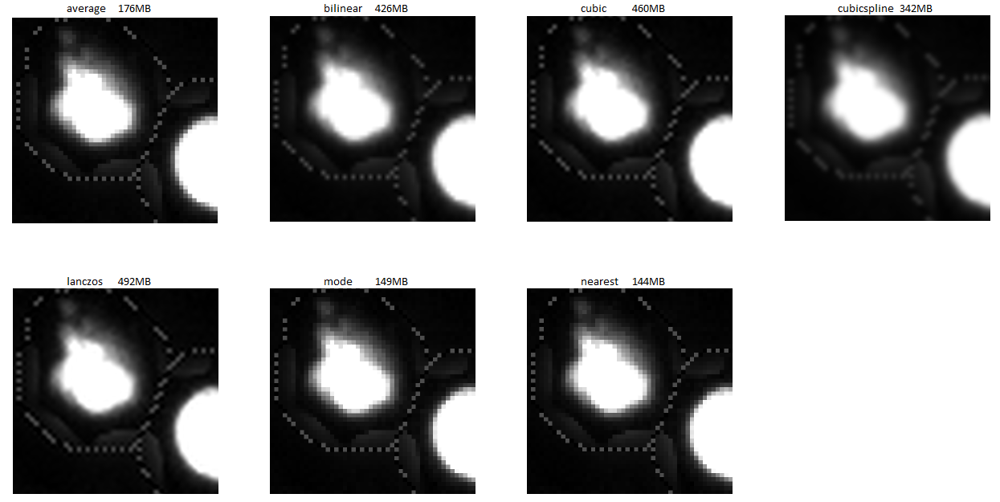
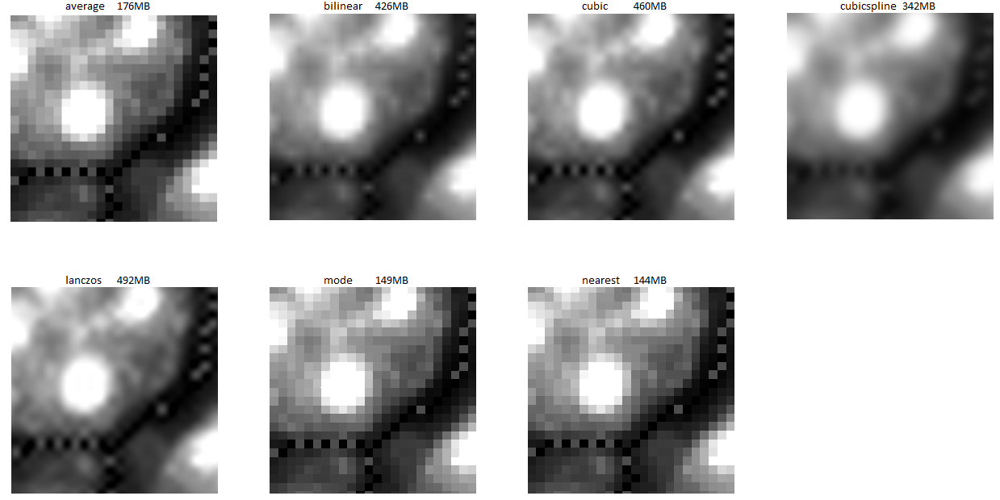

Dashboard link: [https://acycliq.github.io/issplus/](https://acycliq.github.io/issplus/)

## Notes:
Background image taken from:  
`\\basket.cortexlab.net\data\kenneth\iss\170315_161220KI_4-3\Output\background_boundaries.tif`

## Notes (to myself):
1. Upscale the image so that the longest side is 65536px wide. That allows you to zoom 8 levels deep. (You will need these two numbers later on)
2. Now you can break-up the image into tiles. I used gdal2tiles for this, but its a bit tricky to install its dependencies. It is easier to install OSGeo4W which has gdal2tiles as a package (There is a post on the web for this, I think it was this one https://alastaira.wordpress.com/2011/07/11/maptiler-gdal2tiles-and-raster-resampling/)
3. gdal2tiles however will give tiles with different orientation (i think its called tms??). Download gdal2tilesG.py (from https://gist.github.com/jeffaudi/9da77abf254301652baa) and put it in the same folder as gdal2tiles.py that came with OSGeo4W.
4. Open an OSGeo4W shell
5. gdal2tiles needs explicit unit8, therefore you have to scale the bit depth. Do this with the following: (otherwise the tiles look fuzzy, blurry, messed-up). Run that in the OSGeo4W shell:  
      `gdal_translate -ot Byte -scale "imageFilename_in.tif" out.tif`
6. You can now do the tiles. Run that in the OSGeo4W shell:  
      `python C:\OSGeo4W64\bin\gdal2tilesG.py -p raster -z 0-8 -w none out.tif`
  
   - You need to target gdal2tilesG.py **not** gdal2tiles.py
   - switch `-z 0-8` sets the zoom levels. 8 is the maximun and **has** to be the correct one, ie the one that corresponds to your image   dimensions. In this case image is 65536px wide which allows up to 8 zoom levels. If you put something else instead of 8 the tiles are going to be wrong.
  
"# spacetx" 
